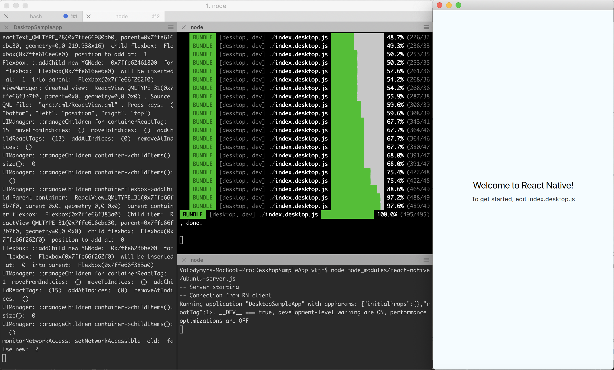

## Overview

### Create project
React native projects creating goes with the help of command line interface (`react-native-cli` package). `react-native-desktop` adds a modification to that package to support desktop platform.

#### Use modified `react-native-cli` globally
If all the projects you develop need desktop support, you can install modified command line interface globally by following [these steps](docs/InstallUpdatedReactNativeCLI.md)

After that you create a new project:
```sh
react-native init DesktopSampleApp
cd DesktopSampleApp
```

#### Use modified `react-native-cli` locally
Alternative and more flexible way is to install original `react-native-cli`:
```sh
npm install -g react-native-cli # Or use Yarn
```
And create project that uses a react-native-desktop repo:
```sh
react-native init DesktopSampleApp --version status-im/react-native-desktop
```
Since we used original `react-native-cli`, desktop-related files aren't in project yet. So we should initialize them:
```sh
cd DesktopSampleApp
react-native desktop
```

### Run the project
If you're using macOS, run these commands in 2 different shells (from `DesktopSampleApp` dir):
```sh
npm start #starts bundler
```
```sh
node node_modules/react-native/ubuntu-server.js #starts js server
```

Afterwards, in a 3rd shell execute:
```sh
react-native run-desktop
```
Compilation of desktop project will start. When it finished and app run you can see following:



**Note:** On non-macOS systems, `npm start` and `node ubuntu-server.js` will be executed automatically by the above command


**If you want to know why you had to start bundler and js server** - check the doc on [how react-native-desktop works internally](docs/HowRNDesktopAppWorks.md)
