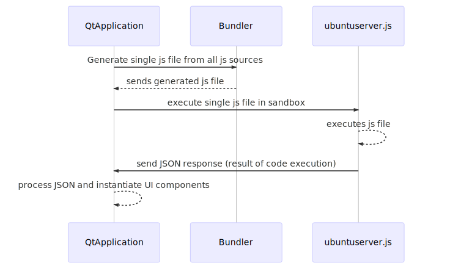

# How react-native-desktop works internally

## Desktop project code
When you create project with `react-native init SomeProject` you have ios and android-specific files generated immediately. To add desktop platform files you have to invoke `react-native desktop` command (in your project folder). `SomeProject/desktop` folder will be generated. It contains `CMakeLists.txt` for building desktop Qt application.

## Starting the app

### Participants
There are 3 participants in react-native-desktop application:
- Qt application
- Bundler
- JS server (right now called ubuntu-server, but this is subject to change)

**Qt application** - built from project in `desktop` folder. When runs it establishes communication with JS server and shows appropriate UI.

**Bundler** - this server runs on developer's machine and provides access to js files from project. Also it can generate "bundle" - single js file with all project code in it. Not needed for distribution. 

**JS server** - provides sandbox for running javascript project code. Communicates with Qt Application.

### Steps





Code for diagram (for future changes:)

```
sequenceDiagram
QtApplication->>Bundler: Generate single js file from all js sources
Bundler-->>QtApplication: sends generated js file
QtApplication->>ubuntuserver.js: execute single js file in sandbox
ubuntuserver.js-->>ubuntuserver.js: executes js file
ubuntuserver.js->> QtApplication: send JSON response (result of code execution)
QtApplication-->> QtApplication: process JSON and instantiate UI components
```
